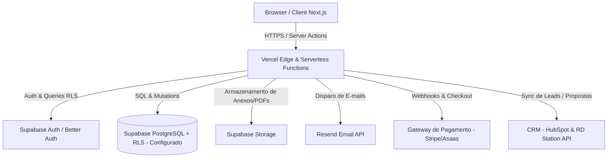
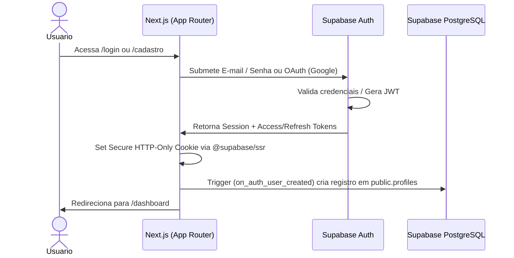
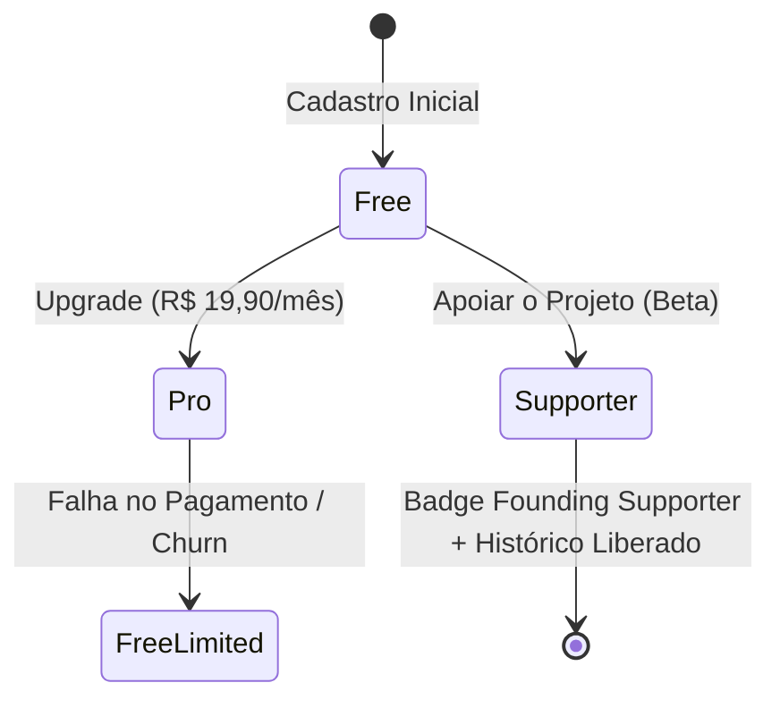

# Product Requirements Document (PRD) — BOB.OS (Calculadora de Freelas SaaS)

**Versão:** 1.1.0  
**Data:** Julho/2026  
**Autores:** Equipe de Produto e Engenharia BOB.OS  
**Status:** Em Desenvolvimento (Beta / MVP) — *Aprovado e Revisado*  

---

## 1. Visão do Produto
O **BOB.OS (Calculadora de Freelas)** é um ecossistema operacional e comercial projetado para erradicar a desvalorização do trabalho autônomo no mercado criativo e de tecnologia no Brasil. 

Nossa visão é transformar a precificação complexa em uma experiência visual, simples e matematicamente imbatível, conectando o custo de vida real do profissional às métricas estratégicas de mercado (complexidade, urgência, valor agregado e licenciamento de direitos). O BOB.OS evolui de uma simples calculadora para um **sistema operacional de vendas para autônomos e estúdios**, gerando propostas comerciais irresistíveis, contratos profissionais, integrando CRM e gerindo o fluxo de fechamento de negócios.

---

## 2. Problema e Oportunidade

### 2.1 O Problema
1. **Precificação por "Chute" e Síndrome do Impostor:** 8 em cada 10 freelancers cobram com base no "sentimento" ou em comparações superficiais, sem calcular seus custos fixos, depreciação de equipamentos, horas não faturáveis e margem de segurança.
2. **Ignorância Fiscal e de Direitos:** A maioria dos profissionais não repassa adequadamente os impostos (MEI, Simples Nacional ou Lucro Presumido) nem cobra por **Direitos de Uso (Licenciamento)** ou taxas de urgência, gerando prejuízos ocultos.
3. **Propostas e Contratos Amadores:** O envio de orçamentos em mensagens de texto ou planilhas desformatadas (e a ausência de contratos de prestação de serviço claros) reduz a percepção de valor, diminui drasticamente as taxas de conversão e gera insegurança jurídica.
4. **Desorganização do Funil de Vendas:** Autônomos perdem o timing de follow-up e não possuem integração simples com ferramentas de CRM.

### 2.2 A Oportunidade
- O mercado da *Creator Economy* e de profissionais independentes (designers, desenvolvedores, gestores de tráfego, videomakers) cresce dois dígitos ao ano no Brasil.
- Existe uma lacuna para uma ferramenta em português, com design **state-of-the-art (moderno, dark mode, gamificado e premium)**, que pegue na mão do usuário desde o cálculo de seus custos pessoais até a assinatura do contrato e a gestão em um CRM profissional.
- Estratégia de entrada de baixo atrito (Plano Gratuito generoso) com transição suave para um **Plano Pro altamente acessível (R$ 19,90/mês)**, gerando volume de MRR (Receita Recorrente Mensal) por escala.

---

## 3. Personas

### 🎯 Persona 1: Lucas, o Designer/Dev Sênior ("O Estratégico")
- **Perfil:** 28 anos, atua há 6 anos no mercado, fatura entre R$ 8.000 e R$ 15.000/mês.
- **Dores:** Perde horas montando propostas personalizadas no InDesign/Figma e redigindo contratos. Tem dificuldade em justificar o valor de projetos complexos de branding ou software de escopo fechado.
- **Necessidades:** Precisa de um motor que calcule precificação baseada em valor (*Value-Based Pricing*), exporte propostas interativas e gere contratos com templates jurídicos prontos que impressionem clientes corporativos.

### 🎯 Persona 2: Marina, Fundadora de Estúdio Boutique ("A Gestora")
- **Perfil:** 34 anos, gerencia um estúdio enxuto com 3 freelancers parceiros e 1 sócio.
- **Dores:** Precisa padronizar a forma como a equipe calcula orçamentos e gerenciar contratos recorrentes (*Retainers*). Perde leads por falta de acompanhamento no CRM.
- **Necessidades:** Integração nativa com CRMs (HubSpot / RD Station), geração rápida de contratos e relatórios de lucratividade por cliente.

### 🎯 Persona 3: Pedro, o Freelancer em Ascensão ("O Iniciante/Pleno")
- **Perfil:** 23 anos, recém-saído do regime CLT ou em transição de carreira, fatura até R$ 4.000/mês.
- **Dores:** Não sabe quanto vale sua hora, tem pavor de cobrar caro e perder o cliente ou cobrar barato e pagar para trabalhar.
- **Necessidades:** Um guia passo a passo (*Onboarding*) que calcule seu custo de vida e defina seu valor-hora mínimo de forma automática e segura.

---

## 4. Jobs to Be Done (JTBD)

| Tipo | Declaração do Job to Be Done |
| :--- | :--- |
| **Funcional** | *"Quando recebo uma solicitação de orçamento complexa, quero calcular rapidamente o preço exato considerando meus custos, impostos e escopo, para enviar uma proposta lucrativa e um contrato seguro sem gastar horas em planilhas."* |
| **Emocional** | *"Quando envio uma proposta comercial para um cliente grande, quero me sentir seguro e respaldado por dados e contratos profissionais, eliminando a ansiedade e a síndrome do impostor durante a negociação."* |
| **Social** | *"Quando o cliente abre meu orçamento, quero que ele enxergue profissionalismo e sofisticação, percebendo-me como uma autoridade estratégica e não como um prestador operacional barato."* |

---

## 5. Requisitos Funcionais e Não Funcionais

### 5.1 Requisitos Funcionais (RF)
- **RF01 - Motor de Cálculo de 7 Camadas:** O sistema deve calcular preços baseando-se em: (1) Custo da Hora Técnica, (2) Tempo estimado, (3) Multiplicador de Complexidade, (4) Taxa de Urgência, (5) Porte do Cliente, (6) Licenciamento de Direitos de Uso e (7) Margem extra + Impostos (MEI/Simples/Lucro Presumido).
- **RF02 - Perfil de Custos e Custo de Vida:** Permitir o cadastro de despesas fixas, variáveis, margem de lucro pessoal desejada e horas produtivas mensais para definir a "Hora Base" do usuário.
- **RF03 - Gerador e Gestor de Propostas:** Capacidade de gerar propostas visuais (link interativo na web + exportação em PDF) e gerenciar status (Rascunho, Enviada, Aprovada, Rejeitada).
- **RF04 - Autenticação Completa:** Sistema de login via e-mail/senha, Google OAuth e Magic Links geridos pelo Supabase Auth.
- **RF05 - Gestão de Assinaturas e Planos (Monetização):**
  - **Plano Livre:** Cálculo ilimitado de orçamentos e até **10 propostas salvas no histórico**.
  - **Botão "Apoiar o Projeto" (Beta):** Sistema de apoio espontâneo (contribuição voluntária sem valor fixo atrelado a assinatura mercantil). O apoiador ganha o badge exclusivo de **"Founding Supporter"** e **acesso liberado ao histórico de propostas**.
  - **Plano Pro (R$ 19,90/mês - Pós-Beta):** Acesso ilimitado a propostas, geração de contratos, envio de e-mails diretamente pela plataforma, benchmark salarial e integração com CRMs.
- **RF06 - Disparo de E-mails Transacionais:** Integração com Resend para envio automático de e-mails. **Funcionalidade Exclusiva Pro:** Disparo da proposta diretamente para o e-mail do cliente com rastreamento de abertura. No Plano Livre, restringe-se a e-mails de sistema (boas-vindas e alertas de conta).
- **RF07 - Geração de Contratos de Prestação de Serviços (Exclusivo Pro):** Módulo de geração automática de contratos vinculados à proposta aprovada, contendo pelo menos **1 template jurídico revisado por categoria de serviço** (ex: Design, Desenvolvimento Web, Audiovisual, Consultoria, Redação/Copywriting).
- **RF08 - Integração de CRM (Exclusivo Pro):** Sincronização automática de leads/clientes e status de propostas com **HubSpot** e **RD Station**.
- **RF09 - Benchmark de Mercado:** Comparador de preços que exibe se o orçamento calculado está dentro, acima ou abaixo da média praticada no mercado brasileiro por especialidade e senioridade.

### 5.2 Requisitos Não Funcionais (RNF)
- **RNF01 - Performance (Core Web Vitals):** A aplicação deve renderizar em menos de 1.5s (LCP) utilizando Server-Side Rendering (SSR) e Static Site Generation (SSG) no Vercel.
- **RNF02 - Segurança & Isolamento de Dados (Concluído/Configurado):** Implementação e **configuração realizada** de **Row Level Security (RLS)** no PostgreSQL do Supabase, garantindo que usuários só acessem suas próprias propostas, contratos e configurações fiscais.
- **RNF03 - Excelência UI/UX (Aesthetics):** Design de alto padrão utilizando Tailwind CSS v4 e Radix UI, com Dark Mode nativo, animações fluidas e micro-interações de feedback visual.
- **RNF04 - Responsividade Mobile-First:** A calculadora, visualizador de propostas e gerador de contratos devem funcionar com perfeição em smartphones e tablets.

---

## 6. Arquitetura Técnica



### Stack Tecnológica
- **Frontend & Hosting:** Next.js 16 (App Router, React 19, Server Actions, Turbopack) hospedado na **Vercel**.
- **Styling:** Tailwind CSS v4 + Radix UI (shadcn/ui) + Lucide Icons + Class Variance Authority (CVA).
- **Backend & Database:** Supabase PostgreSQL com **Row Level Security (RLS) configurado e habilitado em 100% das tabelas**.
- **Autenticação:** Supabase Auth (`@supabase/ssr` + `@supabase/supabase-js`) com persistência via cookies seguros e verificação em Middleware no Next.js.
- **Storage:** Supabase Storage para logotipos dos estúdios, avatares e PDFs gerados.
- **E-mails:** **Resend SDK** para e-mails transacionais (templates geridos via React Email).
- **Pagamentos:** Gateway de pagamento via Webhook (ex: Stripe ou Asaas) processando assinaturas recorrentes (Pro R$ 19,90/mês) e doações/apoios voluntários.

---

## 7. Modelo de Dados (Supabase PostgreSQL)

```sql
-- 1. Perfis de Usuários
CREATE TABLE public.profiles (
  id UUID REFERENCES auth.users(id) ON DELETE CASCADE PRIMARY KEY,
  full_name TEXT NOT NULL,
  email TEXT UNIQUE NOT NULL,
  company_name TEXT,
  avatar_url TEXT,
  hourly_rate_default NUMERIC(10, 2) DEFAULT 50.00,
  tax_regime TEXT CHECK (tax_regime IN ('mei', 'simples', 'lucro_presumido', 'autonomo')) DEFAULT 'mei',
  plan_type TEXT CHECK (plan_type IN ('free', 'pro', 'supporter')) DEFAULT 'free',
  badge TEXT, -- Ex: 'Founding Supporter'
  stripe_customer_id TEXT,
  created_at TIMESTAMPTZ DEFAULT NOW(),
  updated_at TIMESTAMPTZ DEFAULT NOW()
);

-- 2. Custos Operacionais e Pessoais
CREATE TABLE public.user_costs (
  id UUID PRIMARY KEY DEFAULT gen_random_uuid(),
  user_id UUID REFERENCES public.profiles(id) ON DELETE CASCADE NOT NULL,
  category TEXT CHECK (category IN ('fixed_business', 'fixed_personal', 'software', 'hardware', 'other')) NOT NULL,
  name TEXT NOT NULL,
  monthly_amount NUMERIC(10, 2) NOT NULL,
  created_at TIMESTAMPTZ DEFAULT NOW()
);

-- 3. Propostas / Orçamentos Gerados
CREATE TABLE public.quotes (
  id UUID PRIMARY KEY DEFAULT gen_random_uuid(),
  user_id UUID REFERENCES public.profiles(id) ON DELETE CASCADE NOT NULL,
  client_name TEXT NOT NULL,
  client_email TEXT,
  project_title TEXT NOT NULL,
  pricing_method TEXT NOT NULL,
  estimated_hours INTEGER NOT NULL,
  complexity_level TEXT NOT NULL,
  urgency_level TEXT NOT NULL,
  client_size TEXT NOT NULL,
  usage_rights TEXT NOT NULL,
  final_value NUMERIC(12, 2) NOT NULL,
  status TEXT CHECK (status IN ('draft', 'sent', 'viewed', 'approved', 'rejected')) DEFAULT 'draft',
  public_share_token UUID UNIQUE DEFAULT gen_random_uuid(),
  crm_synced BOOLEAN DEFAULT FALSE,
  created_at TIMESTAMPTZ DEFAULT NOW(),
  updated_at TIMESTAMPTZ DEFAULT NOW()
);

-- 4. Contratos (Plano Pro)
CREATE TABLE public.contracts (
  id UUID PRIMARY KEY DEFAULT gen_random_uuid(),
  quote_id UUID REFERENCES public.quotes(id) ON DELETE CASCADE NOT NULL,
  user_id UUID REFERENCES public.profiles(id) ON DELETE CASCADE NOT NULL,
  category_template TEXT CHECK (category_template IN ('design', 'development', 'audiovisual', 'consulting', 'copywriting', 'general')) NOT NULL,
  content_html TEXT NOT NULL,
  status TEXT CHECK (status IN ('draft', 'pending_signature', 'signed', 'canceled')) DEFAULT 'draft',
  created_at TIMESTAMPTZ DEFAULT NOW(),
  updated_at TIMESTAMPTZ DEFAULT NOW()
);

-- 5. Assinaturas e Apoio ao Projeto
CREATE TABLE public.subscriptions (
  id UUID PRIMARY KEY DEFAULT gen_random_uuid(),
  user_id UUID REFERENCES public.profiles(id) ON DELETE CASCADE NOT NULL,
  status TEXT CHECK (status IN ('active', 'canceled', 'past_due', 'trialing', 'supporter_one_time')) NOT NULL,
  price_id TEXT,
  gateway_subscription_id TEXT UNIQUE,
  current_period_end TIMESTAMPTZ,
  created_at TIMESTAMPTZ DEFAULT NOW()
);

-- 6. Integrações de CRM (HubSpot / RD Station)
CREATE TABLE public.crm_integrations (
  id UUID PRIMARY KEY DEFAULT gen_random_uuid(),
  user_id UUID REFERENCES public.profiles(id) ON DELETE CASCADE NOT NULL,
  provider TEXT CHECK (provider IN ('hubspot', 'rd_station')) NOT NULL,
  api_key TEXT,
  access_token TEXT,
  refresh_token TEXT,
  is_active BOOLEAN DEFAULT TRUE,
  created_at TIMESTAMPTZ DEFAULT NOW(),
  UNIQUE(user_id, provider)
);

-- RLS CONFIGURADO E ATIVO EM TODAS AS TABELAS
ALTER TABLE public.profiles ENABLE ROW LEVEL SECURITY;
ALTER TABLE public.user_costs ENABLE ROW LEVEL SECURITY;
ALTER TABLE public.quotes ENABLE ROW LEVEL SECURITY;
ALTER TABLE public.contracts ENABLE ROW LEVEL SECURITY;
ALTER TABLE public.subscriptions ENABLE ROW LEVEL SECURITY;
ALTER TABLE public.crm_integrations ENABLE ROW LEVEL SECURITY;
```

---

## 8. Fluxos de Autenticação



1. **Cadastro Gratuito:** O usuário se cadastra com e-mail/senha ou Google OAuth. Um trigger no banco de dados cria automaticamente sua entrada na tabela `profiles` com o plano `free`.
2. **Proteção de Rotas:** O arquivo `middleware.ts` intercepta todas as requisições para `/(app)/*` e valida o token JWT usando a biblioteca `@supabase/ssr`. Se a sessão for inválida, redireciona para `/login`.
3. **Magic Link:** Suporte nativo ao envio de links de acesso sem senha via Resend (SMTP personalizado do Supabase).

---

## 9. Fluxos de Pagamento e Monetização

### 9.1 Fase 1: Beta e Apoiadores ("Apoiar o Projeto")
- **Objetivo:** Captar early-adopters e financiar o desenvolvimento durante a fase Beta com engajamento comunitário.
- **Mecânica:** Exibição de um CTA de destaque "🚀 Apoiar o Projeto" no Dashboard. O usuário realiza um apoio financeiro espontâneo (sem valor mercantil fixado ou promessa de plano vitalício).
- **Reconhecimento & Benefícios:** Ao confirmar o apoio, o sistema confere ao perfil o badge exclusivo de **"Founding Supporter"** e **libera o acesso ao histórico sem limite de propostas salvas**.

### 9.2 Fase 2: Lançamento do Plano Pro (R$ 19,90/mês)


- **Transição:** Com o lançamento comercial, o Plano Pro (R$ 19,90/mês) passa a centralizar as features corporativas:
  - Envio de propostas diretamente pelo e-mail do cliente (via Resend) com rastreamento.
  - Gerador de **Contratos de Prestação de Serviços** com templates categorizados.
  - Sincronização nativa de propostas com **HubSpot** e **RD Station**.
  - Módulo de Benchmark de Mercado.
- **Gestão de Falhas e Inadimplência:** 
  - Caso o webhook de cobrança recorrente reporte falha no pagamento (ex: cartão recusado ou atraso), o sistema rebaixa o usuário graciosamente para o plano Free.
  - O histórico é preservado, mas a criação de novas propostas é bloqueada caso o usuário já possua 10 ou mais propostas salvas.
  - No módulo de **Contratos**, caso ocorra falha na identificação do pagamento, **bloqueia-se a geração e emissão de contratos** após uma tolerância máxima de até 2 contratos pendentes.

---

## 10. Critérios de Aceitação

### CA01 — Motor de Cálculo (Precificação)
- **Dado** que estou preenchendo a calculadora de 7 passos,
- **Quando** altero a carga horária estimada ou o nível de urgência ("Para Ontem" -> multiplicador 1.5x),
- **Então** o valor final da proposta em "Resultado" deve ser recalculado e re-renderizado instantaneamente no frontend sem recarregar a página ou fazer requisições lentas ao servidor.

### CA02 — Limite do Plano Livre (10 Propostas)
- **Dado** que possuo uma conta com plano `free` e já tenho 10 propostas salvas no meu histórico,
- **Quando** tento salvar a 11ª proposta,
- **Então** o sistema deve bloquear a ação e exibir um Modal interativo apresentando os benefícios do Plano Pro (R$ 19,90/mês) e o botão para o checkout.

### CA03 — Apoio ao Projeto (Founding Supporter)
- **Dado** que clico no botão "Apoiar o Projeto" e concluo minha contribuição,
- **Quando** o webhook de confirmação é processado pela API,
- **Então** meu perfil deve receber imediatamente o badge visual de **"Founding Supporter"** no dashboard e o limite de 10 propostas salvas deve ser removido.

### CA04 — Envio de E-mail para Cliente (Exclusivo Pro)
- **Dado** que sou um usuário `free` visualizando uma proposta salva,
- **Quando** tento clicar na opção de "Enviar direto para e-mail do cliente",
- **Então** o sistema deve indicar que esta é uma feature **Pro** e sugerir o upgrade. Para usuários **Pro**, o e-mail deve ser disparado normalmente via Resend.

### CA05 — Geração de Contrato (Exclusivo Pro)
- **Dado** que sou um usuário Pro e tenho uma proposta aprovada,
- **Quando** acesso a aba "Gerar Contrato" e seleciono a categoria do serviço (ex: Desenvolvimento Web),
- **Então** o sistema deve carregar o template jurídico correspondente, preencher automaticamente as partes contratantes, escopo e valores da proposta, permitindo a exportação em PDF.

### CA06 — Bloqueio de Contratos por Falha de Pagamento
- **Dado** que sou um assinante Pro com status de pagamento falho (`past_due`),
- **Quando** tento emitir novos contratos na plataforma,
- **Então** o sistema deve bloquear a criação (tolerando no máximo 2 contratos emitidos no período de carência/inadimplência) e solicitar a regularização do cartão de crédito.

---

## 11. Roadmap por Versões

### 📦 v0.1 — MVP Alpha (Foco: Core Value & Usabilidade)
- [x] Motor de cálculo básico de 7 passos com multiplicadores dinâmicos.
- [x] Interface visual responsiva com suporte a Dark Mode e animações (Tailwind v4 + Radix UI).
- [x] Armazenamento temporário e persistência local do perfil de custos.
- [x] Configuração de RLS (Row Level Security) nas tabelas do Supabase.
- [ ] Configuração do Supabase Auth (E-mail/Senha e Google OAuth).
- [ ] Implementação do botão "Apoiar o Projeto" (Badge Founding Supporter + Histórico liberado).

### 📦 v0.2 — Beta Público (Foco: Retenção & E-mails)
- [ ] Banco de dados relacional Supabase PostgreSQL estruturado para 10 propostas no plano gratuito.
- [ ] Gestão completa de histórico de propostas (Salvar, Editar, Excluir, Duplicar).
- [ ] Visualizador público de propostas (Link compartilhável para o cliente final).
- [ ] Exportação de propostas em formato PDF limpo e formatado.
- [ ] Integração com **Resend** para e-mails de sistema (Boas-vindas e alertas).
- [ ] Implementação do gateway de pagamento para transição em direção ao Plano Pro.

### 🚀 v1.0 — Lançamento Oficial (Foco: Escala, Pro, Contratos & CRM)
- [ ] Lançamento oficial do **Plano Pro (R$ 19,90/mês)** com controle automático de limites e regras de inadimplência.
- [ ] Módulo de **Geração de Contratos de Prestação de Serviços** com 1+ template por categoria (exclusivo Pro).
- [ ] Disparo de propostas diretamente para o e-mail do cliente via **Resend** (exclusivo Pro).
- [ ] Módulo de **Benchmark Salarial e Honorários**: comparação de valores cobrados com dados agregados do mercado brasileiro.
- [ ] Integração nativa com **HubSpot CRM** para criação e avanço de deals/negócios.
- [ ] Integração nativa com **RD Station CRM / Marketing** para nutrição de leads.
- [ ] Assistente com IA para revisão de escopo e geração automática de descrições de serviços em propostas.

---

## 12. Métricas de Sucesso (KPIs & OKRs)

| Categoria | Métrica / Indicador | Meta (Ano 1) | Justificativa / Impacto |
| :--- | :--- | :--- | :--- |
| **North Star Metric** | **Volume Total em R$ de Propostas Geradas e Aprovadas/Mês (GMV)** | **R$ 2.500.000,00 / mês** | Reflete o real valor financeiro e sucesso comercial que a ferramenta entrega para o ecossistema de usuários. |
| **Ativação** | % de novos usuários que completam o Onboarding de Custos e geram 1º orçamento em 24h | **> 65%** | Mede a clareza da interface e a rapidez no *"Time-to-Value"*. |
| **Retenção** | MAU (Monthly Active Users) e Retenção na Semana 4 (W4) | **MAU > 10.000<br>W4 Retention > 35%** | Demonstra que a ferramenta virou rotina operacional no dia a dia do profissional. |
| **Conversão Pro** | % de conversão de usuários ativos Free -> Pro (ou Apoiador) | **> 6.5%** | Valida a estratégia de precificação acessível (R$ 19,90/mês) e a força do paywall. |
| **Churn** | Taxa de cancelamento mensal de assinantes Pro | **< 4.5% / mês** | Indica sustentabilidade financeira e satisfação contínua com as ferramentas avançadas (Contratos, CRM, Benchmark). |

---

## 13. Backlog Priorizado (Metodologia MoSCoW)

### 🔴 Must Have (Obrigatório para o Sucesso do MVP e V1.0)
- [x] Configuração de segurança no banco de dados (**RLS configurado**).
- [ ] Autenticação via **Supabase Auth** e persistência das propostas (limite de **10 no Plano Free**).
- [ ] Gerador de link público de propostas para visualização do cliente final.
- [ ] Sistema de apoio comunitário ("Apoiar o Projeto") com concessão do badge **Founding Supporter** e liberação de histórico.
- [ ] Sistema de checkout e webhooks para cobrança da assinatura **Pro (R$ 19,90/mês)** com trava de inadimplência (bloqueio após 2 contratos).
- [ ] Disparo de e-mails de propostas para o cliente final via **Resend** (exclusivo Pro).

### 🟡 Should Have (Importante, mas não bloqueia o primeiro teste de fogo)
- [ ] Módulo de **Geração de Contratos** com pelo menos 1 template por categoria de serviço (Design, Dev, etc.).
- [ ] Exportação de orçamentos e contratos em PDF.
- [ ] Notificação no painel quando o cliente abrir o link público da proposta.
- [ ] Integração com **HubSpot CRM** para sincronização de contatos e negócios.
- [ ] Integração com **RD Station CRM/Marketing**.

### 🔵 Could Have (Desejável para agregação de valor extra no curto/médio prazo)
- [ ] Banco de dados de **Benchmark Salarial** por região do Brasil e nível de senioridade.
- [ ] Personalização com logo e paleta de cores do estúdio nas propostas (*White-label* básico).
- [ ] Gráficos interativos no dashboard com a receita total orçada vs aprovada no mês.

### ⚪ Won't Have (Não será feito no momento atual / Futuro distante)
- [ ] Plano vitalício mercantil ou venda de assinatura vitalícia como modelo de negócio padrão.
- [ ] Sistema próprio de cobrança e emissão de boleto/Pix embutido dentro da proposta para o cliente final (focaremos apenas nas propostas; o recebimento fica a cargo de bancos/gateways externos do usuário).
- [ ] Gestão completa de tarefas e kanban de execução de projetos (o foco permanece na precificação, vendas, propostas e contratos).

---
*Este documento é a referência única de verdade (Single Source of Truth) para o desenvolvimento evolutivo da plataforma BOB.OS.*
